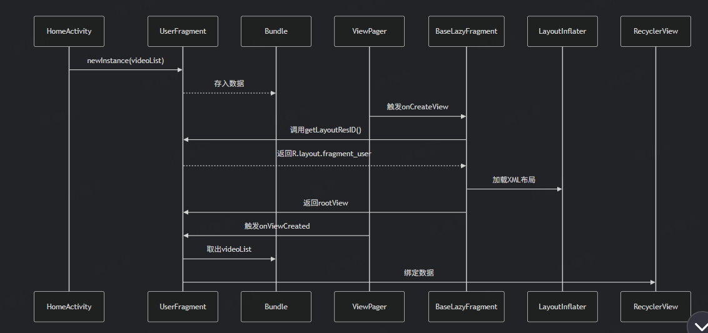

### Android 基本知识点总结
https://blog.csdn.net/qq_41872247/article/details/105040290

#### 问题：
1.问题;到底是怎么几把换的fragement
到底是在哪里应用了fragement_user?????
### ！
将Fragment添加到Activity中一般有2种方法:

在Activity的layout.xml布局文件中静态添加
在Activity的.java文件中动态添加

### 核心问题解答  在改userfragment的时候的疑问：homeactivity是怎么和user fragment绑定的
为什么没看见 XML 布局文件？
布局文件确实存在，但不在代码中直接引用，而是通过资源 ID 关联。实际布局文件在 res/layout/ 目录下（如 fragment_user.xml）

为什么 UserFragment 没重写 onCreateView 却能显示布局？
因为继承链在起作用：
UserFragment → BaseLazyFragment → Fragment
你看到的 onCreateView() 实际是在 BaseLazyFragment 中实现的

完整协作流程剖析
1. HomeActivity 触发页面创建
   java
   // HomeActivity.java
   fragments.add(UserFragment.newInstance(absXml.videoList));
   创建 UserFragment 实例并存入集合

此时尚未创建任何视图，只是准备数据

2. UserFragment 的工厂方法
   java
   // UserFragment.java
   public static UserFragment newInstance(List<Video> videos) {
   UserFragment fragment = new UserFragment();
   Bundle args = new Bundle();
   args.putParcelableArrayList("VIDEO_LIST", new ArrayList<>(videos));
   fragment.setArguments(args);
   return fragment;
   }
   关键点：UserFragment 没有重写 onCreateView

说明布局加载由父类处理

3. 继承链的关键 - BaseLazyFragment
   java
   // BaseLazyFragment.java
   public abstract class BaseLazyFragment extends Fragment {
   protected View rootView;

   @Override
   public View onCreateView(@NonNull LayoutInflater inflater,
   @Nullable ViewGroup container,
   @Nullable Bundle savedInstanceState) {
   // 1. 屏幕适配处理
   AutoSize.autoConvertDensity(getActivity(), getSizeInDp(), isBaseOnWidth());

        // 2. 核心布局加载逻辑
        if (null == rootView) {
            // 调用抽象方法获取布局ID
            rootView = inflater.inflate(getLayoutResID(), container, false);
        }
        
        isViewCreated = true;
        return rootView;
   }

   // 抽象方法 - 强制子类实现
   protected abstract int getLayoutResID();
   protected abstract int getSizeInDp();
   protected abstract boolean isBaseOnWidth();
   }
4. UserFragment 的实现关键
   java
   // UserFragment.java
   public class UserFragment extends BaseLazyFragment {

   // 实现父类要求的抽象方法
   @Override
   protected int getLayoutResID() {
   return R.layout.fragment_user; // 实际布局文件在这里！
   }

   @Override
   protected int getSizeInDp() {
   return 360; // 设计图基准宽度
   }

   @Override
   protected boolean isBaseOnWidth() {
   return true;
   }

   @Override
   public void onViewCreated(@NonNull View view, @Nullable Bundle savedInstanceState) {
   super.onViewCreated(view, savedInstanceState);
   // 在这里绑定数据到布局
   List<Video> videos = getArguments().getParcelableArrayList("VIDEO_LIST");
   RecyclerView recyclerView = view.findViewById(R.id.recyclerView);
   // 设置适配器等...
   }
   }
   布局显示的核心原理
   布局文件位置
   实际存在于：res/layout/fragment_user.xml

加载触发时机
当 ViewPager 需要显示该 Fragment 时，系统自动调用：

text
BaseLazyFragment.onCreateView()
→ inflater.inflate(R.layout.fragment_user)
→ 创建真实视图
为什么不用显式重写 onCreateView
通过模板方法模式：

父类 BaseLazyFragment 处理通用逻辑（布局加载/适配等）

子类只需提供布局 ID（getLayoutResID()）

符合"不要重复自己"(DRY)原则

### activity和fragment是怎么绑定的？
HomeActivity 与 UserFragment 的绑定是通过 ViewPager 和 FragmentPagerAdapter 实现的，整个过程分为数据准备、视图创建和系统绑定三个阶段。以下是详细机制：

绑定流程解析（以 UserFragment 为例）
1. 数据准备阶段（HomeActivity 中）
   java
   // 1. 创建Fragment实例（此时尚未加载布局）
   UserFragment userFragment = UserFragment.newInstance(absXml.videoList);

// 2. 添加到Fragment集合
fragments.add(userFragment);

// 3. 创建适配器（连接Activity与Fragment的桥梁）
pageAdapter = new HomePageAdapter(getSupportFragmentManager(), fragments);

// 4. 设置到ViewPager
mViewPager.setAdapter(pageAdapter);
关键对象：fragments 是 List<Fragment> 集合，包含所有页面

适配器作用：管理 Fragment 生命周期和位置映射

2. 视图创建阶段（系统自动触发）
   当 ViewPager 需要显示某个页面时：

java
// 在ViewPager内部（系统行为）：
Fragment fragment = adapter.getItem(position); // 获取UserFragment实例
View view = fragment.onCreateView(...);       // 触发BaseLazyFragment.onCreateView()
addView(view);                               // 将Fragment的根视图添加到ViewPager
触发时机：页面滑动到目标位置或初始化时

布局加载：实际发生在 BaseLazyFragment.onCreateView() 中

3. 布局绑定机制（BaseLazyFragment 中）
   java
   public View onCreateView(LayoutInflater inflater, ViewGroup container, Bundle savedInstanceState) {
   // 通过抽象方法获取子类提供的布局ID
   int layoutId = getLayoutResID(); // 由UserFragment实现

   // 加载真实XML布局
   rootView = inflater.inflate(layoutId, container, false);

   return rootView;
   }
   UserFragment的实现：

java
public class UserFragment extends BaseLazyFragment {
@Override
protected int getLayoutResID() {
return R.layout.fragment_user; // 实际布局XML
}
}
布局文件位置：res/layout/fragment_user.xml（物理存在但代码不直接引用）

